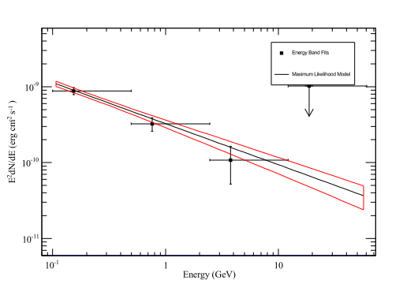
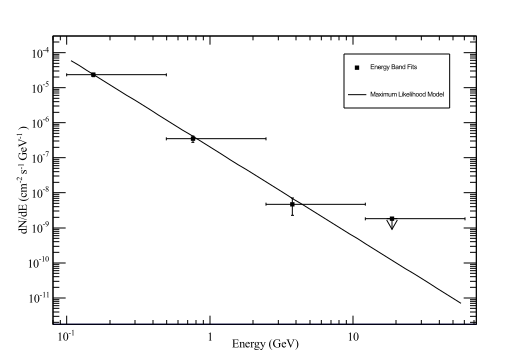
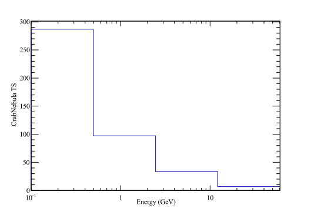

# Crab Nebula analysis #

## Introduction ##

We all know that the Crab has a nebula and a pulsar. From Fermi data, it is possible to disentangle, even if not completely, the emission
from the nebula and from the pulsar. To do this, we will have to assign a pulse phase to each photon according to the pulsar properties like spin period, derivative and so on. These information are contained in the so called ephemerides of the pulsar. Usually you can find the ephemerides here: [https://fermi.gsfc.nasa.gov/ssc/data/access/lat/ephems/](https://fermi.gsfc.nasa.gov/ssc/data/access/lat/ephems/). <br>
The ephemerides I used were provided by Matthew Kerr, but they are in the repository. <br>

The data we are going to analyze are from the Crab flare of March 2013. You can find a reference in [https://arxiv.org/abs/1308.6698v1](https://arxiv.org/abs/1308.6698v1). <br>

This file contains all the commands I run to perform the pulse assignment of the events
and the likelihood analysis. <br>
All the commands were run from the Crab\_Flare\_2014 directory. (I called it 2014 by mistake, I realized too late '-.-) <br>
In order not to overwrite the files in the directory, you can create a new one and copy the
event and spacecraft files (L1707191221448796F97375\_PH00.fits and L1707191221448796F97375\_SC00.fits) and 
the ephemerides file (Crab\_ephem\_new.par) in the new directory. <br>
After that you can issue the same commands you find below. 

Another possibility is to download the same dataset I used, see the section "Setup and data selection" of this tutorial. Of course the names of the files will be different at that point, so be careful.

You can find the content of this tutorial at the links [https://fermi.gsfc.nasa.gov/ssc/data/analysis/scitools/pulsar\_gating\_tutorial.html](https://fermi.gsfc.nasa.gov/ssc/data/analysis/scitools/pulsar_gating_tutorial.html) and [https://fermi.gsfc.nasa.gov/ssc/data/analysis/scitools/likelihood_tutorial.html](https://fermi.gsfc.nasa.gov/ssc/data/analysis/scitools/likelihood_tutorial.html).

## A bit of nomenclature ##

During the Fermi analysis, there will be few recurring terms which can be useful to define here:

* FT1 file or events file: it is the FITS file containing the events
* FT2 file or spacecraft file: it is the file containing the information of the spacecraft (position, pointing direction ecc..)
* ROI (Region Of Interest): it is the circular region selected when downloading the data, which can be modified during the analysis
* Source region: it is the circular region where we are going to consider the sources (point-like or extended) which can contribute to the counts in the ROI. Usually it is bigger than the ROI

## Setup and data selection ##

The data were already downloaded, so we don't need to download them. In any case, the link to
the LAT Data Server is [https://fermi.gsfc.nasa.gov/cgi-bin/ssc/LAT/LATDataQuery.cgi](https://fermi.gsfc.nasa.gov/cgi-bin/ssc/LAT/LATDataQuery.cgi). If you want to analyze the same dataset, here below you can find the settings to be used in the LAT data server:

* Object name or coordinates: Crab 
* Coordinate system: J2000  
* Search radius (degrees): 30 
* Observation dates: 383270403, 385300803
* Time system: MET
* Energy range (MeV): 100, 500000
* LAT data type: Photon
* Spacecraft data: Checked

First we setup the Fermi tools:

      [fermi-cta@localhost Crab_Flare_2014]$ source $HOME/fermitools_heasoft.sh

Then we use **gtselect** to do data selection. Since the data I downloaded were on a region of 30 deg radius and 100 MeV-500 GeV energy range, I will shrink the radius of the ROI down to 15 deg and modify the energy range to 100 MeV-300 GeV. When running **gtselect** and other Fermi tools executables, you will get a prompt with the inputs needed. Also, I specify the event class and event type (see the introduction to the hands on done on Monday by Francesco).

      [fermi-cta@localhost Crab_Flare_2014]$ gtselect evclass=128 evtype=3
      Input FT1 file[] L1707191221448796F97375_PH00.fits
      Output FT1 file[] Crab_Flare_2014_select.fits 
      RA for new search center (degrees) (0:360) [INDEF] 83.63308333
      Dec for new search center (degrees) (-90:90) [INDEF] 22.0145
      radius of new search region (degrees) (0:180) [15] 
      start time (MET in s) (0:) [INDEF] 
      end time (MET in s) (0:) [INDEF] 
      lower energy limit (MeV) (0:) [] 100 
      upper energy limit (MeV) (0:) [] 300000
      maximum zenith angle value (degrees) (0:180) [] 90 
      Done.

In this case I specified the coordinates of the Crab which were the ones when I downloaded the data. To see which are the coordinates in the event file, you can run **gtvcut**:

      fermi-cta@localhost Crab_Flare_2014]$ gtvcut L1707191221448796F97375_PH00.fits

From *gtvcut* output you can find easily the RA nad Dec of the source (Crab). <br>

You can see that for the *start time* and *end time* parameters we left **INDEF**. It means that **gtselect** will read those values from the input FT1 file.

**NOTE: a known bug of gtselect is that if you choose one of RA, Dec or radius as INDEF, also the other two will be left as INDEF. See the end of the README for gtselect at the link [https://fermi.gsfc.nasa.gov/ssc/data/analysis/scitools/help/gtselect.txt](https://fermi.gsfc.nasa.gov/ssc/data/analysis/scitools/help/gtselect.txt)**

After the selection in time, energy and position, we want to select from the spacecraft file the so called *Good Time Intervals*, that is the time intervals in which Fermi did not have any problems. To do that, we use **gtmktime**:

      [fermi-cta@localhost Crab_Flare_2014]$ gtmktime 
      Spacecraft data file[] L1707191221448796F97375_SC00.fits
      Filter expression[] (DATA_QUAL>0) && (LAT_CONFIG==1)
      Apply ROI-based zenith angle cut[] no
      Event data file[] Crab_Flare_2014_select.fits
      Output event file name[] Crab_Flare_2014_gti.fits

Before going on, we check the selection we made with **gtvcut**:

      [fermi-cta@localhost Crab_Flare_2014]$ gtvcut Crab_Flare_2014_gti.fits 
      Extension name[EVENTS] 
      DSTYP1: BIT_MASK(EVENT_CLASS,128,P8R2)
      DSUNI1: DIMENSIONLESS
      DSVAL1: 1:1
      
      DSTYP2: POS(RA,DEC)
      DSUNI2: deg
      DSVAL2: CIRCLE(83.63308333,22.0145,15)
      
      DSTYP3: TIME
      DSUNI3: s
      DSVAL3: TABLE
      DSREF3: :GTI
      
      GTIs: (suppressed)
      
      DSTYP4: BIT_MASK(EVENT_TYPE,3,P8R2)
      DSUNI4: DIMENSIONLESS
      DSVAL4: 1:1
      
      DSTYP5: ENERGY
      DSUNI5: MeV
      DSVAL5: 100:300000
      
      DSTYP6: ZENITH_ANGLE
      DSUNI6: deg
      DSVAL6: 0:95

The several parameters are described by DSS keys which you can see from **gtvcut** output. For example, the first DSS key describes the event class we selected, the second the position and radius region and so on. <br>
**NOTE: check that there are not two DSS keys with the same name (TYP): it means that you have two cuts on that parameter. If you go on with the analysis, you will get a crash. So, go back and run again gtselect and gtmktime properly!**

## Count map and count cube ##

When you have the selected data, you can create a count map (integrate over all the energy range) with **gtbin**:

      [fermi-cta@localhost Crab_Flare_2014]$ gtbin
      This is gtbin version ScienceTools-v10r0p5-fssc-20150518
      Type of output file (CCUBE|CMAP|LC|PHA1|PHA2|HEALPIX) [CMAP] 
      Event data file name[Crab_Flare_2014_gti.fits] 
      Output file name[Crab_Flare_2014_cmap.fits] 
      Spacecraft data file name[L1707191221448796F97375_SC00.fits] 
      Size of the X axis in pixels[150] 300
      Size of the Y axis in pixels[150] 300
      Image scale (in degrees/pixel)[0.2] 0.1
      Coordinate system (CEL - celestial, GAL -galactic) (CEL|GAL) [CEL] 
      First coordinate of image center in degrees (RA or galactic l)[83.63308333] 
      Second coordinate of image center in degrees (DEC or galactic b)[22.0145] 
      Rotation angle of image axis, in degrees[0] 
      Projection method e.g. AIT|ARC|CAR|GLS|MER|NCP|SIN|STG|TAN:[AIT]

You can see the output fits file with **ds9**:

      [fermi-cta@localhost Crab_Flare_2014]$ ds9 Crab_Flare_2014_cmap.fits

You can create a count cube (count map binned in energy) again with **gtbin**:

      [fermi-cta@localhost Crab_Flare_2014]$ gtbin
      This is gtbin version ScienceTools-v10r0p5-fssc-20150518
      Type of output file (CCUBE|CMAP|LC|PHA1|PHA2|HEALPIX) [CMAP] CCUBE
      Event data file name[Crab_Flare_2014_gti.fits] 
      Output file name[Crab_Flare_2014_cmap.fits] Crab_Flare_2014_ccube.fits 
      Spacecraft data file name[L1707191221448796F97375_SC00.fits] 
      Size of the X axis in pixels[300] 
      Size of the Y axis in pixels[300] 
      Image scale (in degrees/pixel)[0.1] 
      Coordinate system (CEL - celestial, GAL -galactic) (CEL|GAL) [CEL] 
      First coordinate of image center in degrees (RA or galactic l)[83.63308333] 
      Second coordinate of image center in degrees (DEC or galactic b)[22.0145] 
      Rotation angle of image axis, in degrees[0] 
      Projection method e.g. AIT|ARC|CAR|GLS|MER|NCP|SIN|STG|TAN:[AIT] 
      Algorithm for defining energy bins (FILE|LIN|LOG) [LOG] 
      Start value for first energy bin in MeV[100] 
      Stop value for last energy bin in MeV[300000] 
      Number of logarithmically uniform energy bins[30] 35

Again, check the image with **ds9**:

      [fermi-cta@localhost Crab_Flare_2014]$ ds9 Crab_Flare_2014_ccube.fits

## Pulse assignment ##

Since when I did the analysis in the Crab\_Flare\_2014 directory I had two ephemeris files, I renamed Crab\_Flare\_2014\_gti.fits:

      [fermi-cta@localhost Crab_Flare_2014]$ mv Crab_Flare_2014_gti.fits Crab_Flare_gti_new_ephem.fits

For the pulse assigment, we need the pulsar ephemeris. It is just a plain text file with the pulsar features: rotational frequency and first two derivatives, dispersion measure, time range of the validity of the ephemeris and so on. You can see that looking into Crab\_ephem\_new.par. <br>

An explanation of the computations done during pulse phase assignment can be found [here](https://fermi.gsfc.nasa.gov/ssc/data/analysis/documentation/Cicerone/Cicerone_Pulsars/).

To perform the pulse assignment of the events, we use the Fermi plugin of TEMPO2. It will add a column called PULSE\_PHASE to our event file with the pulse phase of each event.

      [fermi-cta@localhost Crab_Flare_2014]$ tempo2 -gr fermi -ft1 Crab_Flare_2014_gti_new_ephem.fits 
       -ft2 L1707191221448796F97375_SC00.fits -f Crab_ephem_new.par -phase -graph 0
      This program comes with ABSOLUTELY NO WARRANTY.
      This is free software, and you are welcome to redistribute it
      under conditions of GPL license.
      
      Looking for /usr/share/tempo2/T2runtime/plugins//fermi_linux-gnu_plug.t2
      
      ------------------------------------------
      Output interface:    fermi
      Author:              Lucas Guillemot
      Updated:             10 April 2017
      Version:             6.0
      ------------------------------------------
      
      First photon date in FT1: 383272238.211687 MET (s)
       Last photon date in FT1: 385297201.030515 MET (s)
      
      Adding new column PULSE_PHASE.
      
      First START date in FT2:  383270375.600000 MET (s)
       Last START date in FT2:  385299302.600000 MET (s)
      
      [tempo2Util.C:360] Warning: [CLK3] no clock corrections available for clock UTC(coe) for MJD 56303.2
      [tempo2Util.C:360] Warning: [CLK4] Trying assuming UTC = UTC(coe)
      [tempo2Util.C:360] Warning: [CLK9] ... ok, using stated approximation 
      [tempo2Util.C:365] Warning: [DUP1] duplicated warnings have been suppressed.
      [tempo2Util.C:360] Warning: [CLK6] Proceeding assuming UTC =  UTC(coe)
      Treating events # 1 to 10000... 
      Treating events # 10001 to 20000... 
      Treating events # 20001 to 30000... 
      Treating events # 30001 to 40000... 
      Treating events # 40001 to 50000... 
      Treating events # 50001 to 55207... 
      Done with J0534+2200

After inspecting the pulse phase light curve with **fv**:

      [fermi-cta@localhost Crab_Flare_2014]$ fv Crab_Flare_2014_gti_new_ephem.fits

we see that the so called off-phase region (so the nebula contribution) is between 0.5 and 0.9 pulse phase. 


We use again **gtselect** to select the pulse phase interval:

      [fermi-cta@localhost Crab_Flare_2014]$ gtselect evclass=128 evtype=3 phasemin=.5 phasemax=.9
      Input FT1 file[L1707191221448796F97375_PH00.fits] Crab_Flare_2014_gti_new_ephem.fits 
      Output FT1 file[Crab_Flare_2014_select.fits] Crab_Flare_2014_05_09_phasecut.fits
      RA for new search center (degrees) (0:360) [83.63308333] 
      Dec for new search center (degrees) (-90:90) [22.0145] 
      radius of new search region (degrees) (0:180) [15] 
      start time (MET in s) (0:) [INDEF] 
      end time (MET in s) (0:) [INDEF] 
      lower energy limit (MeV) (0:) [100] 
      upper energy limit (MeV) (0:) [300000] 
      maximum zenith angle value (degrees) (0:180) [95] 
      Done.

**REMEMBER: since you cut events from the data, when we will do the likelihood analysis and obtain the fluxes of the sources, we have to scale the flux by the fraction of data we removed. In our case, where we cut from 0.5 to 0.9 in phase, the scale factor will be 1/(0.9-0.5)=1/0.4=2.5**

We can create a count map of the output file (Crab\_Flare\_2014\_05\_09\_phasecut.fits) and compare it with the one we did before. You can see that the Crab is a lot fainter.

      [fermi-cta@localhost Crab_Flare_2014]$ gtbin
      This is gtbin version ScienceTools-v10r0p5-fssc-20150518
      Type of output file (CCUBE|CMAP|LC|PHA1|PHA2|HEALPIX) [CCUBE] CMAP
      Event data file name[Crab_Flare_2014_gti.fits] Crab_Flare_2014_05_09_phasecut.fits 
      Output file name[Crab_Flare_2014_ccube.fits] Crab_Flare_2014_05_09_phasecut_cmap.fits
      Spacecraft data file name[L1707191221448796F97375_SC00.fits] 
      Size of the X axis in pixels[300] 
      Size of the Y axis in pixels[300] 
      Image scale (in degrees/pixel)[0.1] 
      Coordinate system (CEL - celestial, GAL -galactic) (CEL|GAL) [CEL] 
      First coordinate of image center in degrees (RA or galactic l)[83.63308333] 
      Second coordinate of image center in degrees (DEC or galactic b)[22.0145] 
      Rotation angle of image axis, in degrees[0] 
      Projection method e.g. AIT|ARC|CAR|GLS|MER|NCP|SIN|STG|TAN:[AIT] 

      [fermi-cta@localhost Crab_Flare_2014]$ ds9 Crab_Flare_2014_05_09_phasecut_cmap.fits

We can compare the two count maps:

- before removal


- after removal


## Exposure map calculation ##

To compute the exposure map, first you have to produce the so called livetime cube (the time that the LAT observed a given position on the sky at a given inclination angle) with **gtltcube**:

      [fermi-cta@localhost Crab_Flare_2014]$ gtltcube zmax=90
      Event data file[Crab_Flare_2014_gti_new_ephem.fits] Crab_Flare_2014_05_09_phasecut.fits 
      Spacecraft data file[L1707191221448796F97375_SC00.fits] L1707191221448796F97375_SC00.fits 
      Output file[Crab_Flare_2014_ltcube.fits] Crab_Flare_2014_nebula_ltcube.fits
      Step size in cos(theta) (0.:1.) [0.025] 
      Pixel size (degrees)[1] 
      Working on file L1707191221448796F97375_SC00.fits
      .....................!

After that, we can compute the exposure map (takes time) with **gtexpmap**:

      [fermi-cta@localhost Crab_Flare_2014]$ gtexpmap 
      The exposure maps generated by this tool are meant
      to be used for *unbinned* likelihood analysis only.
      Do not use them for binned analyses.
      Event data file[] Crab_Flare_2014_05_09_phasecut.fits 
      Spacecraft data file[] L1707191221448796F97375_SC00.fits 
      Exposure hypercube file[] Crab_Flare_2014_nebula_ltcube.fits 
      output file name[] Crab_Flare_2014_nebula_expmap.fits 
      Response functions[CALDB] 
      Radius of the source region (in degrees)[30] 
      Number of longitude points (2:1000) [120] 
      Number of latitude points (2:1000) [120] 
      Number of energies (2:100) [20] 30
      Computing the ExposureMap using Crab_Flare_2014_nebula_ltcube.fits
      ....................!

You can inspect the exposure in the energy bins with **ds9**:

      [fermi-cta@localhost Crab_Flare_2014]$ ds9 Crab_Flare_2014_nebula_expmap.fits

Here below is the exposure map for the first energy bin:


## Model creation ##

To perform the likelihood analysis, we need a source model. The model describes the spectra of all the sources in the so called source region. One will be of
course the source we are analyzing, while the others will be sources contributing to the expected number of counts. Of course, we will take into account of
the galactic diffuse emission and isotropic emission. The spectra and parameters of the sources will be taken from the 3FHL catalog.

To create the source model, first I downloaded some needed files:

- the FITS file containing the galactic diffuse background modeled emission:
      
            [fermi-cta@localhost Crab_Flare_2014]$ wget -q https://fermi.gsfc.nasa.gov/ssc/data/analysis/software/aux/gll_iem_v06.fits &

- the TXT file containing the isotropic background emission:

            [fermi-cta@localhost Crab_Flare_2014]$ wget -q https://fermi.gsfc.nasa.gov/ssc/data/analysis/software/aux/iso_P8R2_SOURCE_V6_v06.txt &

- the python script to produce the input model for our likelihood:

            [fermi-cta@localhost Crab_Flare_2014]$ wget -q https://fermi.gsfc.nasa.gov/ssc/data/analysis/user/make3FGLxml.py &

- the FITS file containing the sources in the 3FHL catalog:

            [fermi-cta@localhost Crab_Flare_2014]$ wget -q https://fermi.gsfc.nasa.gov/ssc/data/access/lat/4yr_catalog/gll_psc_v16.fit &

If you are working in a new directory, copy those files in the current directory. To say the truth, the first two files are already available inside the directory:

            $FERMI_DIR/refdata/fermi/galdiffuse

We are now ready to create our model. There is a user contributed tool called **make3FGLxml.py** which can be used to do that. You can find out all its options and command line arguments with `python make3FGLxml.py -h` or at the link [https://fermi.gsfc.nasa.gov/ssc/data/analysis/user/readme_make3FGLxml.txt](https://fermi.gsfc.nasa.gov/ssc/data/analysis/user/readme_make3FGLxml.txt).

Here below you find an example applied to our Crab nebula case:

      [fermi-cta@localhost Crab_Flare_2014]$ python make3FGLxml.py gll_psc_v16.fit Crab_Flare_2014_05_09_phasecut.fits -o input_model.xml
      -G gll_iem_v06.fits -g gll_iem_v06 -I iso_P8R2_SOURCE_V6_v06.txt -i iso_P8R2_SOURCE_V6_v06 -r 0.001
      This is make3FGLxml version 01r0.
      The default diffuse model files and names are for pass 8 and assume you have v10r00p05 of the Fermi Science Tools or higher.
      Creating file and adding sources from 3FGL
      Extended source S 147 in ROI, make sure $(LATEXTDIR)/Templates/S147.fits is the correct path to the extended template.
      Extended source IC443 in ROI, make sure $(LATEXTDIR)/Templates/IC443.fits is the correct path to the extended template.
      Added 123 point sources and 2 extended sources
      If using unbinned likelihood you will need to rerun gtdiffrsp for the extended sources or rerun the makeModel function with optional argument psForce=True

A bit of explanation:

- the first argument is the FITS file containing the 3FHL catalog
- the second argument is the event file
- **-o** specifies the name of the output model file
- **-G** specifies the location of the galactic diffuse emission FITS file
- **-g** specifies the name of the galactic diffuse emission in the output model
- **-I** specifies the location of the isotropic emission file
- **-i** specifies the name of the isotropic emission in the output model
- **-r** specifies the radius beyond which the parameters of the source will be fixed

If you look into the output file of **make3FGLxml.py** called input\_model.xml, there are 3 sources positionally consistent with the Crab:

```html
<source ROI_Center_Distance="0.005" name="3FGL J0534.5+2201i" type="PointSource">
        <spectrum apply_edisp="false" type="PowerLaw">
        <!-- Source is 0.00537482056489 degrees away from ROI center -->
        <!-- Source parameters were held fixed in 3FGL analysis, free at your own discretion -->
                <parameter free="0" max="1e4" min="1e-4" name="Prefactor" scale="1e-11" value="1.83367123568"/>
                <parameter free="0" max="10.0" min="0.0" name="Index" scale="-1.0" value="1.64"/>
                <parameter free="0" max="5e5" min="30" name="Scale" scale="1.0" value="1000.000000"/>
        </spectrum>
        <spatialModel type="SkyDirFunction">
                <parameter free="0" max="360.0" min="-360.0" name="RA" scale="1.0" value="83.6331"/>
                <parameter free="0" max="90" min="-90" name="DEC" scale="1.0" value="22.0199"/>
        </spatialModel>
</source>
<source ROI_Center_Distance="0.005" name="3FGL J0534.5+2201s" type="PointSource">
        <spectrum apply_edisp="false" type="PowerLaw">
        <!-- Source is 0.00537482056489 degrees away from ROI center -->
                <parameter free="1" max="1e4" min="1e-4" name="Prefactor" scale="1e-8" value="1.14475824375"/>
                <parameter free="1" max="10.0" min="0.0" name="Index" scale="-1.0" value="5.71589"/>
                <parameter free="0" max="5e5" min="30" name="Scale" scale="1.0" value="100.797539"/>
        </spectrum>
        <spatialModel type="SkyDirFunction">
                <parameter free="0" max="360.0" min="-360.0" name="RA" scale="1.0" value="83.6331"/>
                <parameter free="0" max="90" min="-90" name="DEC" scale="1.0" value="22.0199"/>
        </spatialModel>
</source>
<source ROI_Center_Distance="0.010" name="3FGL J0534.5+2201" type="PointSource">
        <spectrum apply_edisp="false" type="PLSuperExpCutoff">
        <!-- Source is 0.0103450223494 degrees away from ROI center -->
                <parameter free="1" max="1e4" min="1e-4" name="Prefactor" scale="1e-10" value="5.99114591271"/>
                <parameter free="1" max="10.0" min="0.0" name="Index1" scale="-1.0" value="2.04501"/>
                <parameter free="1" max="1e5" min="1e1" name="Cutoff" scale="1.0" value="8143.043457"/>
                <parameter free="0" max="5e5" min="30" name="Scale" scale="1.0" value="635.591125"/>
                <parameter free="0" max="5" min="0" name="Index2" scale="1.0" value="1.000000"/>
        </spectrum>
        <spatialModel type="SkyDirFunction">
                <parameter free="0" max="360.0" min="-360.0" name="RA" scale="1.0" value="83.6372"/>
                <parameter free="0" max="90" min="-90" name="DEC" scale="1.0" value="22.0241"/>
        </spatialModel>
</source>
```

We have three models for the Crab since its emission was modeled with three components in the 3FHL catalog: the Inverse Compton (3FGL J0534.5+2201i) and the Synchrotron (3FGL J0534.5+2201s)
emissions for the nebula as two power laws and the pulsar emission (3FGL J0534.5+2201).

To simplify the model, replace the previous section with:

```html
<source name="CrabNebula" type="PointSource">
        <spectrum apply_edisp="false" type="PowerLaw">
                <parameter free="1" max="1e4" min="1e-4" name="Prefactor" scale="1e-8" value="1.14475824375"/>
                <parameter free="1" max="10.0" min="0.0" name="Index" scale="-1.0" value="5.71589"/>
                <parameter free="0" max="5e5" min="30" name="Scale" scale="1.0" value="100.797539"/>
        </spectrum>
        <spatialModel type="SkyDirFunction">
                <parameter free="0" max="360.0" min="-360.0" name="RA" scale="1.0" value="83.63308333"/>
                <parameter free="0" max="90" min="-90" name="DEC" scale="1.0" value="22.0145"/>
        </spatialModel>
</source>
```

If you want to try a different spectral model for the Crab, you can look in [https://fermi.gsfc.nasa.gov/ssc/data/analysis/scitools/source\_models.html](https://fermi.gsfc.nasa.gov/ssc/data/analysis/scitools/source_models.html) and [https://fermi.gsfc.nasa.gov/ssc/data/analysis/scitools/xml\_model\_defs.html#xmlModelDefinitions](https://fermi.gsfc.nasa.gov/ssc/data/analysis/scitools/xml_model_defs.html#xmlModelDefinitions).

From the output of **make3FGLxml.py** we see that in the source region there are two extended sources, S147 and IC443. To compute correctly the contribution of the extended sources, we
need to download the following file:

      [fermi-cta@localhost Crab_Flare_2014]$ wget -q https://fermi.gsfc.nasa.gov/ssc/data/access/lat/4yr_catalog/LAT_extended_sources_v15.tgz &

We will decompress it and copy in the current directory the FITS file corresponding to the two sources:

      [fermi-cta@localhost Crab_Flare_2014]$ tar -xvzf LAT_extended_sources_v15.tgz
      [fermi-cta@localhost Crab_Flare_2014]$ cp Extended_archive_v15/Templates/IC443.fits .
      [fermi-cta@localhost Crab_Flare_2014]$ cp Extended_archive_v15/Templates/S147.fits .

Make sure to change the path of the FITS file in the input model are the correct ones for the extended source. In the case of IC443, you have to replace:

```html
<source ROI_Center_Distance="9.893" name="IC443" type="DiffuseSource">
        <spectrum apply_edisp="false" type="LogParabola">
        <!-- Source is 9.89263159306 degrees away from ROI center -->
        <!-- Source is outside specified radius limit of 0.1 -->
                <parameter free="0" max="1e4" min="1e-4" name="norm" scale="1e-11" value="3.43421263649"/>
                <parameter free="0" max="5.0" min="0.0" name="alpha" scale="1.0" value="1.99989"/>
                <parameter free="0" max="10.0" min="0.0" name="beta" scale="1.0" value="0.133509"/>
                <parameter free="0" max="5e5" min="30" name="Eb" scale="1.0" value="1444.22"/>
        </spectrum>
        <spatialModel file="$(LATEXTDIR)/Templates/IC443.fits" map_based_integral="true" type="SpatialMap">
                <parameter free="0" max="1000" min="0.001" name="Prefactor" scale="1" value="1"/>
        </spatialModel>
</source>
```

with:

```html
<source ROI_Center_Distance="9.893" name="IC443" type="DiffuseSource">
        <spectrum apply_edisp="false" type="LogParabola">
        <!-- Source is 9.89263159306 degrees away from ROI center -->
        <!-- Source is outside specified radius limit of 0.1 -->
                <parameter free="0" max="1e4" min="1e-4" name="norm" scale="1e-11" value="3.43421263649"/>
                <parameter free="0" max="5.0" min="0.0" name="alpha" scale="1.0" value="1.99989"/>
                <parameter free="0" max="10.0" min="0.0" name="beta" scale="1.0" value="0.133509"/>
                <parameter free="0" max="5e5" min="30" name="Eb" scale="1.0" value="1444.22"/>
        </spectrum>
        <spatialModel file="./IC443.fits" map_based_integral="true" type="SpatialMap">
                <parameter free="0" max="1000" min="0.001" name="Prefactor" scale="1" value="1"/>
        </spatialModel>
</source>
```

Of course you have to do the same for S147. Otherwise, you can run again **make3FGLxml.py** with the additional option **-e /path/to/extended/sources/fits** and the path will be put in the extended sources definitions automatically. <br>

To simplify more the model, we fixed the parameters of all the sources except the Crab, the galactic diffuse and isotropic emission. Since we requested the sources beyond 0.001 degrees to be fixed, this was done automatically with the script. Then we rename the output model.

      [fermi-cta@localhost Crab_Flare_2014]$ mv mymodel.xml Crab_nebula.xml

You can find the model XML file in the repository: [Crab\_nebula.xml](https://github.com/sharingan90/sexten_2017/blob/master/fermi/Crab_nebula.xml).

Since we have diffuse sources, we will compute their diffuse response with **gtdiffrsp**:

      [fermi-cta@localhost Crab_Flare_2014]$ gtdiffrsp 
      Event data file[Crab_Flare_2014_05_09_phasecut.fits] 
      Spacecraft data file[L1707191221448796F97375_SC00.fits] 
      Source model file[Crab_nebula.xml] 
      Response functions to use[CALDB] 
      adding source IC443
      adding source S 147
      adding source gll_iem_v06
      adding source iso_P8R2_SOURCE_V6_v06
      Working on...
      Crab_Flare_2014_05_09_phasecut.fits.....................!

It's better to compute the diffuse response before doing the likelihood, because there is a high probability that we will run the likelihood analysis many times. If we do not do it now, when we will run **gtlike**, the diffuse response will be computed every time. Since it can take long, better to do it before just for one time. <br>
Once we have the diffuse response, we can finally perform the Likelihoood minimization with **gtlike**:

      [fermi-cta@localhost Crab_Flare_2014]$ gtlike refit=yes plot=yes sfile=Crab_nebula_output.xml
      Statistic to use (BINNED|UNBINNED) [UNBINNED] 
      Spacecraft file[none] L1707191221448796F97375_SC00.fits 
      Event file[none] Crab_Flare_2014_05_09_phasecut.fits 
      Unbinned exposure map[none] Crab_Flare_2014_nebula_expmap.fits 
      Exposure hypercube file[none] Crab_Flare_2014_nebula_ltcube.fits 
      Source model file[] Crab_nebula.xml 
      Response functions to use[CALDB] 
      Optimizer (DRMNFB|NEWMINUIT|MINUIT|DRMNGB|LBFGS) [MINUIT] NEWMINUIT

The output of **gtlike** is quite long, since it will write all the values of all the parameters of all the sources in the input file. The source model with the parameter values found after the maximization are put in the output model (Crab\_nebula\_output.xml). Moreover, since we enabled the option **refit**, after the first fit, we can fit again starting with the values found in the first maximization to try to have better estimates of the values. <br>
Here below you can find part of the output of **gtlike**:

      CrabNebula:
      Prefactor: 3.751911779 +/- 0.1355590489
      Index: 3.124514894 +/- 0.04227568586
      Scale: 100.797539
      Npred: 2618.147627
      ROI distance: 0
      TS value: 5158.178961
      Flux: 1.814841543e-06 +/- 4.671329399e-08 photons/cm^2/s
      
      IC443:
      norm: 1.207444332 +/- 0.1475324524
      alpha: 1.829382688 +/- 0.08240889151
      beta: 0.1283599027 +/- 0.0492879851
      Eb: 1444.22
      Npred: 257.2745557
      Flux: 1.27875749e-07 +/- 1.795900505e-08 photons/cm^2/s
      
      S 147:
      Prefactor: 1.121540998 +/- 0.4350005657
      Index: 2.604827655 +/- 0.2840344868
      Scale: 705.126282
      Npred: 179.1997756
      Flux: 1.133792631e-07 +/- 2.675292344e-08 photons/cm^2/s
      
      gll_iem_v06:
      Prefactor: 0.4011867121 +/- 0.00744211308
      Index: 0
      Scale: 100
      Npred: 12224.65993
      Flux: 0.0001960401586 +/- 3.63629064e-06 photons/cm^2/s
      
      iso_P8R2_SOURCE_V6_v06:
      Normalization: 0.2242893312 +/- 0.04966209095
      Npred: 929.3634311
      Flux: 3.355467134e-05 +/- 7.423042468e-06 photons/cm^2/s
      
      WARNING: Fit may be bad in range [100, 12197.6] (MeV)
      WARNING: Fit may be bad in range [40536, 60491.9] (MeV)
      
      Total number of observed counts: 20499
      Total number of model events: 23446.86653
      
      -log(Likelihood): 200819.0294
      
      Writing fitted model to Crab_nebula_output.xml
      Refit? [y] 
      n
      Elapsed CPU time: 1281.94
      -->

You can find the summary of sources and their final parameters in the file **result.dat**. <br>

Since we enabled the *plot* option of **gtlike**, we have the plot with the spectra for all sources (the summed model) and for each source indipendently. The second plot shows the residuals of the summed model fit. 


The color codes are:

* Black - summed model
* Red - first source in results.dat file
* Green - second source
* Blue - third source
* Magenta - fourth source
* Cyan - the fifth source
* repetition of the colors starting from red

So it's difficult to find Crab spectrum since it is almost at the end of result.dat :(


The residuals are not so good: this means that the model probably is too simple, but just to learn how to produce a simple model is fine.

**Remember to scale the fluxes of the sources, including the Crab, by 2.5!!! This is because we removed data when cutting on the pulse phase.**

Scaling the flux obtained for the Crab, we obtain:

      Crab flux: 4.53e-06 photons/cm^2/s
      Spectral index: 3.12 +/- 0.04

We compare these values with the one in the paper [https://arxiv.org/abs/1308.6698v1](https://arxiv.org/abs/1308.6698v1):

      Crab flux: 4.05e-06 photons/cm^2/s
      Spectral index: 3.09 +/- 0.03

The flux we found is higher than the one in the paper: this is most probably because we modeled the Crab with just a power law, while in the paper the Crab emission was split into three different components (pulsar emission, Inverse Compton and Synchrotron emission from the nebula) with different spectral functions. <br>
In any case we can see that the spectral index is softer than usual because of the flare, so that we have more low energy photons. You can repeat the analysis, like I did, cutting at 1 GeV instead of 100 MeV for the low energy end of the data selection and see that the spectrum will harden. <br>

# Fermi analysis from Python #

Now that we finished the likelihood, we can try to do the same analysis with the Python wrappers of the Fermi Tools: [https://fermi.gsfc.nasa.gov/ssc/data/analysis/scitools/python_tutorial.html](https://fermi.gsfc.nasa.gov/ssc/data/analysis/scitools/python_tutorial.html). Wrapper just means the following thing: you will use python only to set up the settings for the several executables we used before (**gtselect**, **gtmktime**, **gtltcube** and so on), but at the end the same executables will be called under the hood. So it's not like the Fermi Tools were re-written in Python.


## Data set ##

For the Fermi/Python tutorial, we will use again Crab data but from the whole 2016 year. We will not do any pulse phase selection, so we are considering both the pulsar and the nebula. The settings I used when I downloaded the data from the LAT Data Server are:

* Object name or coordinates: Crab 
* Coordinate system: J2000  
* Search radius (degrees): 30 
* Observation dates: 2016-01-01 00:00:00, 2017-01-01 00:00:00
* Time system: Gregorian
* Energy range (MeV): 100, 500000
* LAT data type: Photon
* Spacecraft data: Checked

In principle you should get 4 photon FT1 files and one spacecraft file. Of course we will do a selection, otherwise the analysis would take too much time. To do that we will use only the first photon file.

For those who are using the virtual machine, the photon file and the spacecraft file (L1707191130548796F97338_PH00.fits and L1707191130548796F97338_SC00.fits) are in the Crab\_2016 directory inside the shared folder.

If you downloaded the data with the previous settings, take only the first photon file (the one with PH00 in the name) and the spacecraft file.

In the following we will refer to the files in the Crab_2016 directory, so make the needed changes if you are using data downloaded by yourself.

## Selection of data ##

As before, if you are using the VM, you have to set the Fermi Tools:

      [fermi-cta@localhost ]$ source $HOME/fermitools_heasoft.sh

Then you can enter in the Crab\_2016 directory inside the shared folder (or enter in the directory where you have the files you downloaded). Create a directory called SED
and move the first photon file and the spacecraft file:

      [fermi-cta@localhost ]$ cd /media/sf_Share/Crab_2016
      [fermi-cta@localhost ]$ mkdir SED
      [fermi-cta@localhost ]$ mv L*PH00.fits L*SC00.fits SED/
      [fermi-cta@localhost ]$ cd SED

At this point we can dig into python (`>>>` is the python interpreter prompt):

      [fermi-cta@localhost ]$ python
      Python 2.7.8 (default, May 20 2015, 15:32:59) 
      [GCC 4.8.3 20140911 (Red Hat 4.8.3-9)] on linux2
      Type "help", "copyright", "credits" or "license" for more information.
      >>>

Now, to use the python wrappers of the Fermi tools, you need to import the module named **gt\_apps**. We will import it with the name **my_apps**:

```python
>>> import gt_apps as my_apps
```

For almost all the Fermi tools executables like **gtselect**, **gtmktime**, **gtexpmap** and so on, the module **gt\_apps** defines a different python object whose attributes are the same as the
command line arguments of the executables.

For example, the corresponding python object for **gtselect** is called **filter**. The attributes are set through python dictionaries (key, value pairs) like shown below:

```python
>>> my_apps.filter['evclass'] = 128
>>> my_apps.filter['evtype'] = 3
>>> my_apps.filter['ra'] = 83.633
>>> my_apps.filter['dec'] = 22.014
>>> my_apps.filter['rad'] = 10
>>> my_apps.filter['emin'] = 100
>>> my_apps.filter['emax'] = 300000
>>> my_apps.filter['zmax'] = 90
>>> my_apps.filter['tmin'] = 473300000
>>> my_apps.filter['tmax'] = 473400000
>>> my_apps.filter['infile'] = 'L1707191130548796F97338_PH00.fits'
>>> my_apps.filter['outfile'] = 'Crab_selection.fits'
```

The meaning of the different keys is pretty self-explanatory. In our case, we reduced the ROI to 10 deg of radius, made a cut in time and reduced the highest energy to 300 GeV.

If you need help or documentation, just do:

```python
>>> help(my_apps)
```

To run **gtselect** through the python wrapper **filter**, just use the **run()** method:

```python
>>> my_apps.filter.run()
time -p /home/fermi-cta/ScienceTools/x86_64-unknown-linux-gnu-libc2.17/bin/gtselect 
infile=L1707191130548796F97338_PH00.fits outfile=Crab_selection.fits ra=83.633 dec=22.014
rad=10.0 tmin=473300000.0 tmax=473400000.0 emin=100.0 emax=300000.0 zmin=0.0 zmax=90.0
evclass=128 evclsmin=0 evclsmax=10 evtype=3 convtype=-1 phasemin=0.0 phasemax=1.0 evtable="EVENTS"
chatter=2 clobber=yes debug=no gui=no mode="ql"
Done.
real 3.89
user 1.33
sys 1.41
```

When calling **run()**, the terminal will show you the command called with the Fermi Tools, in this case **gtselect**, with all the proper command line arguments. You can see that there are some
command line arguments whose values we didn't set through the **filter** attributes. In those cases, the default values are taken e.g. phasemin and phasemax are 0 and 1 respectively i.e. no cut in phase is done.
If we would like to put a cut in the phase, we could do it setting the value for **phasemin** and **phasemax** like we did for the other attributes.

The philosophy shown for **gtselect** works for all the other executables, as long as we know the name of the corresponding python object.

We go on with **gtmktime** and its python object **maketime**:

```python
>>> my_apps.maketime['scfile'] = 'L1707191130548796F97338_SC00.fits'
>>> my_apps.maketime['filter'] = '(DATA_QUAL>0)&&(LAT_CONFIG==1)'
>>> my_apps.maketime['roicut'] = 'no'
>>> my_apps.maketime['evfile'] = 'Crab_selection.fits'
>>> my_apps.maketime['outfile'] = 'Crab_selection_mkt.fits'
>>> my_apps.maketime.run()
time -p /home/fermi-cta/ScienceTools/x86_64-unknown-linux-gnu-libc2.17/bin/gtmktime
scfile=L1707191130548796F97338_SC00.fits sctable="SC_DATA" filter="(DATA_QUAL>0)&&(LAT_CONFIG==1)"
roicut=no evfile=Crab_selection.fits evtable="EVENTS" outfile="Crab_selection_mkt.fits" apply_filter=yes
overwrite=no header_obstimes=yes tstart=0.0 tstop=0.0 gtifile="default" chatter=2 clobber=yes debug=no
gui=no mode="ql"
real 3.25
user 0.13
sys 1.58
```

Before creating the count map, we want to see if our cuts are ok. Since there is no default python object for **gtvcut**, we have to create it:

```python
>>> from GtApp import GtApp
>>> vcut = GtApp('gtvcut', 'Likelihood')
>>> vcut.command()
'time -p /home/fermi-cta/ScienceTools/x86_64-unknown-linux-gnu-libc2.17/bin/gtvcut infile= table="EVENTS"
suppress_gtis=yes chatter=2 debug=no gui=no mode="ql"'
>>> vcut['infile'] = 'Crab_selection_mkt.fits'
>>> vcut.run()
time -p /home/fermi-cta/ScienceTools/x86_64-unknown-linux-gnu-libc2.17/bin/gtvcut infile=Crab_selection_mkt.fits
table="EVENTS" suppress_gtis=yes chatter=2 debug=no gui=no mode="ql"
DSTYP1: BIT_MASK(EVENT_CLASS,128,P8R2)
DSUNI1: DIMENSIONLESS
DSVAL1: 1:1

DSTYP2: POS(RA,DEC)
DSUNI2: deg
DSVAL2: CIRCLE(83.633,22.014,10)

DSTYP3: TIME
DSUNI3: s
DSVAL3: TABLE
DSREF3: :GTI

GTIs: (suppressed)

DSTYP4: BIT_MASK(EVENT_TYPE,3,P8R2)
DSUNI4: DIMENSIONLESS
DSVAL4: 1:1

DSTYP5: ENERGY
DSUNI5: MeV
DSVAL5: 100:300000

DSTYP6: ZENITH_ANGLE
DSUNI6: deg
DSVAL6: 0:90

real 0.13
user 0.06
sys 0.03
```

After seeing that everything is fine, we can go on with the count map, using the **evtbin** object:

```python
>>> my_apps.evtbin['algorithm'] = 'CMAP'
>>> my_apps.evtbin['emin'] = 100
>>> my_apps.evtbin['emax'] = 300000
>>> my_apps.evtbin['evfile'] = 'Crab_selection_mkt.fits'
>>> my_apps.evtbin['scfile'] = 'L1707191130548796F97338_SC00.fits'
>>> my_apps.evtbin['outfile'] = 'Crab_selection_mkt_cmap.fits'
>>> my_apps.evtbin['nxpix'] = 120
>>> my_apps.evtbin['nypix'] = 120
>>> my_apps.evtbin['binsz'] = 0.25
>>> my_apps.evtbin['coordsys'] = 'CEL'
>>> my_apps.evtbin['xref'] = 83.633
>>> my_apps.evtbin['yref'] = 22.014
>>> my_apps.evtbin['axisrot'] = 0
>>> my_apps.evtbin['proj'] = 'AIT'
>>> my_apps.evtbin.run()
time -p /home/fermi-cta/ScienceTools/x86_64-unknown-linux-gnu-libc2.17/bin/gtbin evfile=Crab_selection_mkt.fits
scfile=L1707191130548796F97338_SC00.fits outfile=Crab_selection_mkt_cmap.fits algorithm="CMAP" ebinalg="LOG"
emin=100.0 emax=300000.0 ebinfile=NONE tbinalg="LIN" tbinfile=NONE nxpix=120 nypix=120 binsz=0.25 coordsys="CEL"
xref=83.633 yref=22.014 axisrot=0.0 rafield="RA" decfield="DEC" proj="AIT" hpx_ordering_scheme="RING" hpx_order=3
hpx_ebin=yes evtable="EVENTS" sctable="SC_DATA" efield="ENERGY" tfield="TIME" chatter=2 clobber=yes debug=no gui=no
mode="ql"
This is gtbin version ScienceTools-v10r0p5-fssc-20150518
real 2.37
user 0.20
sys 1.38
```

## Exposure map calculation ##

Let's go on with **gtltcube** and **gtexpmap**, whose python objects are **expCube** and **expMap** respectively:

```python
>>> my_apps.expCube['evfile'] = 'Crab_selection_mkt.fits'
>>> my_apps.expCube['scfile'] = 'L1707191130548796F97338_SC00.fits'
>>> my_apps.expCube['outfile'] = 'Crab_selection_mkt_ltcube.fits'
>>> my_apps.expCube['zmax'] = 90
>>> my_apps.expCube['dcostheta'] = 0.025
>>> my_apps.expCube['binsz'] = 1
>>> my_apps.expCube.run()
time -p /home/fermi-cta/ScienceTools/x86_64-unknown-linux-gnu-libc2.17/bin/gtltcube evfile="Crab_selection_mkt.fits"
evtable="EVENTS" scfile=L1707191130548796F97338_SC00.fits sctable="SC_DATA" outfile=Crab_selection_mkt_ltcube.fits 
dcostheta=0.025 binsz=1.0 phibins=0 tmin=0.0 tmax=0.0 file_version="1" zmin=0.0 zmax=90.0 chatter=2 clobber=yes 
debug=no gui=no mode="ql"
Working on file L1707191130548796F97338_SC00.fits
.....................!
real 9.12
user 4.73
sys 1.92
>>> my_apps.expMap['evfile'] = 'Crab_selection_mkt.fits'
>>> my_apps.expMap['scfile'] = 'L1707191130548796F97338_SC00.fits'
>>> my_apps.expMap['expcube'] = 'Crab_selection_mkt_ltcube.fits'
>>> my_apps.expMap['outfile'] = 'Crab_selection_mkt_expmap.fits'
>>> my_apps.expMap['irfs'] = 'CALDB'
>>> my_apps.expMap['srcrad'] = 30
>>> my_apps.expMap['nlong'] = 120
>>> my_apps.expMap['nlat'] = 120
>>> my_apps.expMap['nenergies'] = 20
>>> my_apps.expMap.run()
time -p /home/fermi-cta/ScienceTools/x86_64-unknown-linux-gnu-libc2.17/bin/gtexpmap evfile=Crab_selection_mkt.fits evtable="EVENTS" scfile=L1707191130548796F97338_SC00.fits sctable="SC_DATA" expcube=Crab_selection_mkt_ltcube.fits outfile=Crab_selection_mkt_expmap.fits irfs="CALDB" evtype="INDEF" srcrad=30.0 nlong=120 nlat=120 nenergies=20 submap=no nlongmin=0 nlongmax=0 nlatmin=0 nlatmax=0 chatter=2 clobber=yes debug=no gui=no mode="ql"
The exposure maps generated by this tool are meant
to be used for *unbinned* likelihood analysis only.
Do not use them for binned analyses.
Computing the ExposureMap using Crab_selection_mkt_ltcube.fits
....................!
real 314.35
user 305.73
sys 6.25
```

## Model creation and diffuse response calculation ##

For the model creation, follow the same instructions for the creation of the model for the Crab nebula analysis. Once you created the model, supposing its name is Crab_SED.xml (if you want, you can find it in the repository: [Crab\_SED.xml](https://github.com/sharingan90/sexten_2017/blob/master/fermi/Crab_SED.xml), you can run **gtdiffrsp** through **diffResps**:

```python
>>> my_apps.diffResps['evfile'] = 'Crab_selection_mkt.fits'
>>> my_apps.diffResps['scfile'] = 'L1707191130548796F97338_SC00.fits'
>>> my_apps.diffResps['srcmdl'] = 'Crab_SED.xml'
>>> my_apps.diffResps['irfs'] = 'CALDB'
>>> my_apps.diffResps.run()
time -p /home/fermi-cta/ScienceTools/x86_64-unknown-linux-gnu-libc2.17/bin/gtdiffrsp evfile=Crab_selection_mkt.fits 
evtable="EVENTS" scfile=L1707191130548796F97338_SC00.fits sctable="SC_DATA" srcmdl=Crab_SED.xml irfs="CALDB" 
evclsmin=0 evclass="INDEF" evtype="INDEF" convert=no chatter=2 clobber=no debug=no gui=no mode="ql"
adding source IC443
adding source S 147
adding source gll_iem_v06
adding source iso_P8R2_SOURCE_V6_v06
Working on...
Crab_selection_mkt.fits.....................!
real 197.66
user 193.49
sys 1.82
```

## Likelihood ##

Let's go on with the likelihood within python. First we have to import the **pyLikelihood** module and then the functions under the **UnbinnedAnalysis** namespace:

```python
>>> import pyLikelihood
>>> from UnbinnedAnalysis import *
```

For more info on the **pyLikelihood** module usage, see [this page](https://fermi.gsfc.nasa.gov/ssc/data/analysis/scitools/python_usage_notes.html).

Then we create **obs**, an object of type **UnbinnedObs**, for which we have to specify (in order) the name of the event file, the spacecraft file, the exposure map
file, the livetime cube file and the IRF type:

```python
>>> obs = UnbinnedObs('Crab_selection_mkt.fits','L1707191130548796F97338_SC00.fits',
expMap='Crab_selection_mkt_expmap.fits',expCube='Crab_selection_mkt_ltcube.fits',irfs='CALDB')
```

We can see the attributes of **obs** with a simple print statement:

```python
>>> print obs
Event file(s): Crab_selection_mkt.fits
Spacecraft file(s): L1707191130548796F97338_SC00.fits
Exposure map: Crab_selection_mkt_expmap.fits
Exposure cube: Crab_selection_mkt_ltcube.fits
IRFs: CALDB
```

We now create **like**, a **UnbinnedAnalysis** object, which takes as attributes one **UnbinnedObs** object, the name of the XML model file and the name of the optimizer:

```python
>>> like = UnbinnedAnalysis(obs,'Crab_SED.xml',optimizer='NewMinuit')
... (warnings that you can skip)
>>> print(like)
Event file(s): Crab_selection_mkt.fits
Spacecraft file(s): L1707191130548796F97338_SC00.fits
Exposure map: Crab_selection_mkt_expmap.fits
Exposure cube: Crab_selection_mkt_ltcube.fits
IRFs: CALDB
Source model file: Crab_SED.xml
Optimizer: NewMinuit
```

We can see the attributes of **like** with:

```python
>>> dir(like)
['NpredValue', 'Ts', 'Ts_old', '_Nobs', '__call__', '__class__', '__delattr__', '__dict__', '__doc__',
'__format__', '__getattribute__', '__getitem__', '__hash__', '__init__', '__module__', '__new__',
'__reduce__', '__reduce_ex__', '__repr__', '__setattr__', '__setitem__', '__sizeof__', '__str__',
'__subclasshook__', '__weakref__', '_errors', '_importPlotter', '_inputs', '_isDiffuseOrNearby',
'_minosIndexError', '_npredValues', '_plotData', '_plotResiduals', '_plotSource', '_renorm', '_separation',
'_setSourceAttributes', '_srcCnts', '_srcDialog', '_xrange', 'addSource', 'covar_is_current', 'covariance',
'deleteSource', 'disp', 'e_vals', 'energies', 'energyFlux', 'energyFluxError', 'fit', 'flux', 'fluxError',
'freePars', 'freeze', 'getExtraSourceAttributes', 'logLike', 'maxdist', 'minosError', 'model', 'nobs',
'normPar', 'observation', 'oplot', 'optObject', 'optimize', 'optimizer', 'par_index', 'params', 'plot',
'plotSource', 'plotSourceFit', 'reset_ebounds', 'resids', 'restoreBestFit', 'saveCurrentFit', 'scan',
'setEnergyRange', 'setFitTolType', 'setFreeFlag', 'setPlotter', 'setSpectrum', 'sourceFitPlots',
'sourceFitResids', 'sourceNames', 'srcModel', 'state', 'syncSrcParams', 'thaw', 'tol', 'tolType',
'total_nobs', 'writeCountsSpectra', 'writeXml']
```

Now, to perform the SED, we need an user contributed script. We exit python and type inside the SED directory:

```bash
$ wget https://fermi.gsfc.nasa.gov/ssc/data/analysis/user/SED_scripts_v13.1.tgz
$ tar -zxvf SED_scripts_v13.1.tgz
$ cp SED_scripts_v13.1/likeSED.p* .
```

The documentation for the python SED script is [here](https://fermi.gsfc.nasa.gov/ssc/data/analysis/user/likeSEDmacros_UsageNotes_v13.pdf).

We go back to the python shell and setup few things:

```python
>>> from likeSED import *
>>> inputs = likeInput(like,'CrabNebula',nbins=5)
>>> inputs.plotBins()
```

The **plotbins** method just calculates the exposure map for each energetic band that we selected (*nbins* parameter).

```python
>>> inputs.fullFit(CoVar=True)
Full energy range model for CrabNebula:
CrabNebula
   Spectrum: PowerLaw
393    Prefactor:  7.070e+01  5.937e+00  1.000e-03  1.000e+03 ( 1.000e-09)
394        Index: -2.541e+00  6.144e-02 -5.000e+00 -1.000e+00 ( 1.000e+00)
395        Scale:  1.000e+02  0.000e+00  3.000e+01  2.000e+03 ( 1.000e+00) fixed

Flux 0.1-300.0 GeV 4.6e-06 +/- 3.2e-07 cm^-2 s^-1
Test Statistic 434.843726813
>>> sed = likeSED(inputs)
>>> sed.getECent()
>>> sed.fitBands()
  -Runnng Likelihood for band0-
  -Runnng Likelihood for band1-
  -Runnng Likelihood for band2-
  -Runnng Likelihood for band3-
0 66.3165318111 8.41680777341e-06 1.40483159789e-08
1 66.9940318111 7.5470495517e-05 1.41914291837e-08
2 67.6715318111 0.000335507354478 1.43348868787e-08
... omitted output
169 180.814031811 1.34086139142 3.83040885654e-08
170 181.491531811 1.35296079983 3.84476139971e-08
171 182.169031811 1.36508712336 3.85911442723e-08
    NOTE: Band3, with center energy 18.7290305302 GeV, quoting 95% upper limit on flux.
```

What we did here was:

* perform the fit for the full energetic band calling the *fullFit* method and keeping the covariance matrix
* create a *likeSED* object
* get the centers of the energy bins with the *getECent* method
* perform the fit for each energy band

At this point we can call the *Plot* method to see the results:

```python
>>> sed.Plot()
```

The resulting plots are here below:

- SED



- count spectrum



- TS vs energy plot



At this point you should have the following files in your directory, after the SED creation:

* three EPS images corresponding to the previous plots
* one ROOT file where the plots are saved
* one FITS file in which all the data used to produce the plots are stored.

The tables needed for the plots production (except the TS one) are the following:

* the **DATA FLUX** table, with 5 columns:

   1. the center of the energy bins
   2. dN/dE in each energy bin
   3. the error on dN/dE
   4. E^2\*dN/dE in each energy bin
   5. the error on E^2\*dN/dE

* the **DATA ENERGY BINS** table, with 2 columns:

   1. the low edges of the bins
   2. the high edges of the bins

This concludes the tutorial. By now you should be able how to perform the likelihood analysis with the Fermi tools and to create the SED of the Crab with the Python wrappers.

CONGRATULATIONS! :D